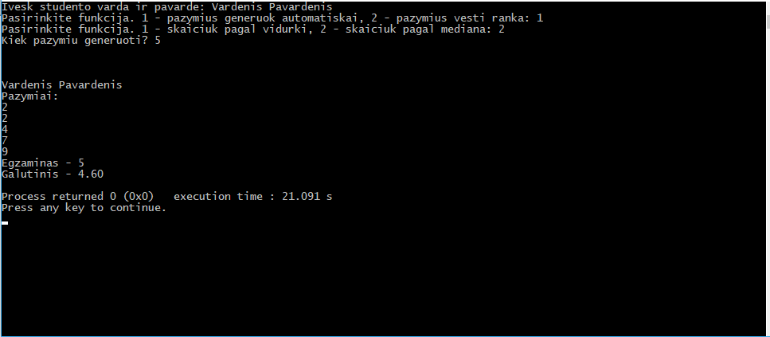

# Augustino Makevičiaus objektinio programavimo 2 užduotis. (VU ISI 1 kursas)
# 
## Programos tikslas
- Programoje nuskaitomi tokie duomenys:
  - Studento vardas, pavardė
  - Studento n atliktų darbų įverčiai dešimtbalėje sistemoje
  - Galutinio egzamino rezultatas dešimtbalėje sistemmoje
- Pagal įvestus duomenis apskaičiuojamas galutinis balas (pagal vidurkį)
- Surinkti duomenys išvedami į ekraną arba į rezultatų failą.
- Vartotojui suteikiama galimybė pažymius generuoti automatiškai.
- Vartotojui suteikiama galimybė galutinį balą apskaičiuoti pagal pažymių medianą

## Programos išvedimas 
## 

## Įdiegimas naudojant `GCC`kompiliatorių 

- `git clone https://github.com/AugustinasMKVU/OOP-Task-2.git`
- `cd OOP-Task-2/uzd2/cpp`
- `g++ -std=c++11 *.cpp  -o main`
- `./main`

## Veikimo spartos analizė
### Matuojame laiką dirbdami su vektoriais, kur n duomenų skaičius (skirstome į du naujus konteinerius)

|Funkcija                     |n = 10    |n = 100     |n = 1000    |n = 10000   |n = 100000 |n = 1000000|
|-----------------------------|----------|------------|------------|------------|-----------|-----------|
|Duomenų nuskaitymas iš failo |0.000994 s|0.003007 s|0.0240739 s |0.237648  s|2.45851  s|13.4069  s|
|Duomenų išrikiavimas         |0        s|0         s|0.0010014 s |0.0110305 s|0.113328 s|0.653712 s|
|Grand Total                  |0.000994 s|0.003007 s|0.0250753 s |0.248679  s|2.57184  s|14.0606  s|

### Matuojame laiką dirbdami su list, kur n duomenų skaičius

|Funkcija                     |n = 10    |n = 100     |n = 1000    |n = 10000   |n = 100000 |n = 1000000|
|-----------------------------|----------|------------|------------|------------|-----------|-----------|
|Duomenų nuskaitymas iš failo |0.001003 s|0.00304 s|0.0240901 s|0.231633  s|2.44951 s|13.4642  s|
|Duomenų išrikiavimas         |0        s|0         s|0.0010023 s|0.0070191 s|0.0792106 s|0.384052 s|
|Grand Total                  |0.001003 s|0.00304 s|0.0250924 s|0.238652  s|2.52872  s|13.8483  s|

### Matuojame laiką dirbdami su deque, kur n duomenų skaičius

|Funkcija                     |n = 10    |n = 100     |n = 1000    |n = 10000   |n = 100000 |n = 1000000|
|-----------------------------|----------|------------|------------|------------|-----------|-----------|
|Duomenų nuskaitymas iš failo |0 s|0.003007 s|0.0029918 s |0.229609  s|2.42745  s|12.1388  s|
|Duomenų išrikiavimas         |0        s|0         s|0 s |0.0070187 s|0.067179 s|0.316844 s|
|Grand Total                  |0 s|0.003007 s|0.0029918 s |0.236628  s|2.49463  s|12.4557  s|

### Išvados:
Jei duomenų skaičius nėra didelis konteinerių sparta yra apyligė, tačiau, kai n >= 100000, pradeda matytis, jog deque yra sparčiausias


## Versijų istorija (changelog)

### [Changelog v0.5 (2018-03-12)](https://github.com/AugustinasMKVU/OOP-Task-2/tree/v0.5) (Naujausia versija)
#### Pridėta
- Sukurtos funkcijos, leidžiančios dirbti su
  ```c++ 
   std::list
   std::deque
  ```
- Įkelti atnaujinti analizės rezultatai: ProfilingResultDeque ir ProfilingResultList
#### Pakeista
- Vektorių analizės rezultatai pervadinti į ProfilingResultVector.
- Atnaujintas ReadMe

### [Pilna versijų istorijos versija](https://github.com/AugustinasMKVU/OOP-Task-2/wiki/Changelog)

## Naudingos nuorodos
[Atsitiktinių skaičių generavimas C++ 11](https://channel9.msdn.com/Events/GoingNative/2013/rand-Considered-Harmful)

